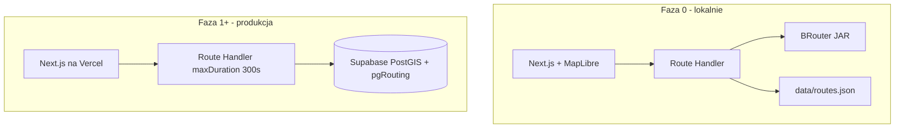
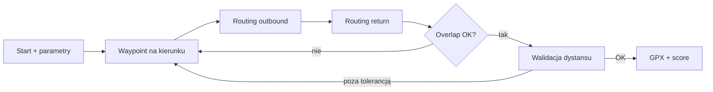

# Loopforge — plan produktu i architektury

## Nazwa i domeny

| Element | Wartość |
|---|---|
| Produkt | **Loopforge** |
| Tagline | Kuźnia pętli rowerowych — generuj trasę, nie szukaj |
| MVP | `loopforge.pl` |
| Rezerwa EU | `loopforge.eu` |
| Repo | `loopforge` (monorepo) |

## Cel

Zamknięty MVP (jeden użytkownik) do generowania tras rowerowych w Polsce — szosa, gravel, MTB, ogólny. Nie routing A→B, tylko **pętle** wg preferencji. Walidacja w terenie przed ewentualnym launch.

## Architektura



## Algorytm generatora pętli



1. Punkt startu + dystans docelowy + kierunek (N/NE/E/…)
2. Waypoint na ~50% dystansu w wybranym kierunku
3. Trasa tam (outbound) + z powrotem (return) — różne profile kosztu
4. Penalty za overlap segmentów (>15% = odrzucenie)
5. Iteracja waypointów aż dystans ±10% i overlap OK
6. Scoring nawierzchni + eksport GPX

## Scoring — wagi per tryb

### Gravel (domyślny MVP)

| Tag OSM | Waga |
|---|---|
| `surface=gravel` | 1.0 |
| `surface=compacted` | 0.9 |
| `surface=unpaved` | 0.7 |
| `surface=dirt` | 0.6 |
| `highway=track` + `tracktype=grade2` | 0.85 |
| `highway=cycleway` | 0.95 |
| `highway=residential` | 0.5 |
| `highway=primary` | 0.1 |

### Szosa

| Tag | Waga |
|---|---|
| `highway=primary/secondary` + `surface=asphalt` | 1.0 |
| `highway=cycleway` | 0.95 |
| `highway=tertiary` | 0.8 |
| `surface=gravel/unpaved` | 0.2 |
| `highway=track` | 0.1 |

### MTB

| Tag | Waga |
|---|---|
| `highway=path/track` + `mtb:scale` | 0.9–1.0 |
| `surface=ground/dirt` | 0.85 |
| `highway=bridleway` | 0.7 |
| `highway=primary` | 0.05 |

### Ogólny (mieszany)

Średnia ważona gravel + szosa, preferencja `highway=cycleway`, unikanie `primary`.

## pgRouting (Faza 1+)

- Import OSM PL przez `osm2pgsql` (Geofabrik `poland-latest.osm.pbf`)
- Tabela `ways` z kolumnami `cost_road`, `cost_gravel`, `cost_mtb`, `cost_general`
- `pgr_dijkstra` / `pgr_withPoints` z kosztem zależnym od trybu
- Precompute `scores_json` na segmentach przy imporcie

## API

### `POST /api/routes/generate`

```json
{
  "start": { "lat": 52.23, "lng": 21.01 },
  "bikeType": "gravel",
  "distanceKm": 45,
  "direction": "NE",
  "profile": "flow"
}
```

Odpowiedź: GeoJSON LineString, metryki (km, przewyższenie, % szuter/gravel), score, `gpxUrl` lub inline GPX.

## Stack

| Warstwa | Technologia |
|---|---|
| Monorepo | pnpm workspaces |
| Frontend | Next.js 15, React, Tailwind, shadcn/ui |
| Mapa | MapLibre GL + OpenFreeMap |
| Routing F0 | BRouter (Java JAR, lokalnie) |
| Routing F1+ | pgRouting na Supabase |
| Baza | Supabase Pro (PostGIS) |
| Deploy | Vercel Pro |
| GPX | `@tmcw/togeojson` / własny exporter |

## Struktura monorepo

```
loopforge/
├── apps/
│   ├── web/              # Next.js UI + API routes
│   └── cli/              # debug / batch generate
├── packages/
│   ├── scoring/          # profile wag OSM
│   ├── generator/        # pętle, waypointy, overlap
│   ├── osm-types/        # typy tagów OSM
│   └── gpx/              # build GPX
├── infra/
│   ├── brouter-profiles/
│   └── scripts/          # osm2pgsql, import
├── supabase/migrations/
├── data/routes.json
├── docs/
└── pnpm-workspace.yaml
```

## Fazy (skrót)

| Faza | Cel | Czas |
|---|---|---|
| 0 | UI + mapa + BRouter lokalnie, 8–12 tras testowych | 2–3 tyg. |
| 1 | OSM → Supabase, pgRouting, deploy loopforge.pl | 3–4 tyg. |
| 2 | Auth zamknięty, historia, feedback | 1–2 tyg. |
| 3 | 24–32 trasy terenowe, strojenie wag | 4–8 tyg. |
| 4 | Go/no-go: ≥70% tras 4+/5 | — |

Szczegóły: [phases.md](./phases.md).

## Ryzyka

| Ryzyko | Mitygacja |
|---|---|
| BRouter wolny / niestabilny | Tylko F0; pgRouting w F1 |
| Brak tagów `surface` w OSM | Domyślne wagi + później ML |
| Timeout Vercel | `maxDuration: 300`, cache segmentów |
| Za duży import OSM | Tylko PL, indeksy przestrzenne |
| Pętle z dużym overlapem | Penalty + max iteracji |

## Poza zakresem MVP

- Publiczny launch / marketing
- Trasy A→B i bikepacking 100+ km
- Aplikacja mobilna natywna
- AI w core routingu (tylko ewentualnie ML nawierzchni później)
- Kraje poza Polską

## Decyzje produktowe (zamrożone)

1. Tylko Polska (OSM PL)
2. Zamknięty dostęp — jeden użytkownik na start
3. Cztery tryby: road, gravel, mtb, general
4. Deterministyczny algorytm — bez LLM w routingu
5. Faza 0 musi mieć mapę — nie CLI-only
6. Nazwa: Loopforge (`loopforge.pl`, `loopforge.eu`)
