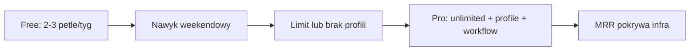

# Loopforge — model biznesowy i plan Pro

Dokument roboczy do powrotu przy monetyzacji. Stan na lipiec 2026.

## Werdykt: freemium + abonament Pro (B2C, PL → później CEE)

Loopforge to narzędzie **rytuału weekendowego** („wygeneruj pętlę i jedź”), nie social network. Skuteczny model:

- **Free** — akwizycja, zaufanie, pierwszy „aha moment”
- **Pro** — nielimitowane generowanie, głębsza kontrola, sync, workflow

Jednorazowa sprzedaż GPX słabo skaluje się z kosztem routingu (Supabase/pgRouting, Vercel). Reklamy psują UX „kuźni”. Marketplace / affiliate — dopiero po działającym MRR.

## Free vs Pro (propozycja)

### Free (zostaje zaufanie)

- 2–3 generacje / tydzień (albo ~10 / miesiąc)
- Podstawowe typy roweru (np. gravel + szosa)
- **Gęsty GPX** — nie paywallować jakości eksportu (Wahoo/Garmin)
- Historia lokalna w przeglądarce

### Pro (~29–39 zł/mies. lub ~249–349 zł/rok)

- Bez limitu generacji
- Wszystkie podprofile (Express, Eksploracyjny, MTB technical…)
- Unikaj asfaltu, dojazd do pętli, punkty via
- Zapis chmurowy + sync między urządzeniami
- Priorytet kolejki (szybsze generowanie w peak)

### Później (rok 2+)

- **Season Pass** sezon gravel (kwiecień–październik), ~149 zł
- **B2B light** — kluby / sklepy (white-label „pętle tygodnia”)
- **Affiliate** — opony, eventy PL (bonus, nie rdzeń)

## Zasada paywalla

> **Pro płaci za „planowanie jak kowal”, nie za sam GPX.**

Eksport zostaje w free — inaczej pęka zaufanie po problemach z jakością nawigacji.

---

## Kandydaci na feature’y Pro

### Tier 1 — najwyższy ROI (wdrożyć pierwsze)

| Feature | Opis | Dlaczego Pro |
|---|---|---|
| **Presety + ulubione starty** | „Z domu”, „Parking przy Wiśle”, zapisane kombinacje typ+dystans+kierunek+profil | Stickiness, powtarzalny weekend |
| **Wiele wariantów naraz** | 3–5 pętli w jednym żądaniu, porównanie dystans/nawierzchnia/przewyższenie | Wykorzystuje istniejący multi-variant w generatorze |
| **Raport przed eksportem** | % nawierzchni, szac. czas, ostrzeżenia (cofanie, za krótka, słaby kierunek) | Wykorzystuje scoring — wartość bez nowego silnika |
| **Historia w chmurze + sync** | Trasy, notatki, oceny na telefonie i laptopie | Naturalny paywall po ~10–20 trasach w localStorage |

### Tier 2 — silna wartość Pro

| Feature | Opis |
|---|---|
| **Inteligentne pętle pod cel** | Max przewyższenie, min. % szuteru, max % asfaltu, blacklist dróg |
| **Dojazd + pętla w jednym GPX** | Dom → pętla → dom; wybór: tylko pętla vs całość |
| **Via rozszerzone** | Więcej punktów, kolejność, „must pass” (most, punkt widokowy) |
| **Eksport rozszerzony** | TCX (Garmin), metadane trasy, segmenty nawierzchni w opisie |

### Tier 3 — później

| Feature | Opis |
|---|---|
| **Tryby sezonowe** | Zima (asfalt), gravel race 80 km, szablony pod Kampinos / Wisłę |
| **„Wygeneruj podobną”** | +5 km, inny kierunek, ten sam profil |
| **PWA / offline** | Ostatnie trasy i GPX bez sieci |

---

## Czego nie chować za Pro (na start)

- Podstawowy, gęsty GPX
- 1–2 sensowne generacje tygodniowo
- Gravel + szosa, dystans + kierunek

## Go-to-market (skrót)

1. Grupy gravel/MTB PL, Strava clubs, Wahoo/Garmin
2. Demo: „30 km na zachód, GPX w 30 s”
3. Trial Pro 7–14 dni po 3. wygenerowanej pętle
4. Soft CTA po limicie free, nie przed pierwszą trasą

## Metryki (pierwsze 6 mies. po launchu płatności)

- Conversion free → Pro: **3–8%** aktywnych miesięcznie
- Churn Pro: **<8%** / mies.
- COGS generacji: **<20%** przychodu Pro
- Retencja D30: powrót na kolejny weekend

## Kolejność wdrożenia technicznego

1. Auth + konta (historia nie tylko localStorage)
2. Limit free + Stripe / Polar Checkout
3. Feature flags na Pro (profile, via, approach, cloud)
4. Billing portal + plan roczny

**Nie budować paywalla zanim:**

- generowanie stabilne w mieście,
- GPX gęsty (5 m) domyślny,
- ~50–100 power userów z feedbackiem.

## Roadmapa Pro v1 (propozycja 4–6 tyg.)

1. Presety tras + ulubiony start
2. 3 warianty naraz + UI porównania
3. Raport przed eksportem (nawierzchnia + ostrzeżenia)
4. Auth + sync historii (fundament pod limit i płatność)

## Jedna linia produktu Pro

> **Nielimitowane pętle + warianty + presety + pełny dojazd + via + raport nawierzchni + chmura**

Cena mentalna: *jedna kawa miesięcznie za to, że nie planuję w Komoot 45 min*.

---

## Powiązane

- [plan.md](./plan.md) — architektura i algorytm
- [phases.md](./phases.md) — fazy wdrożenia MVP
